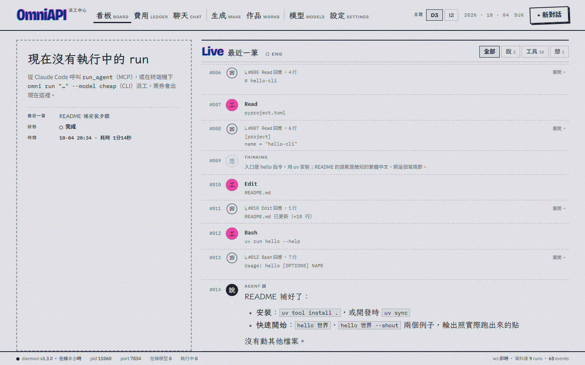
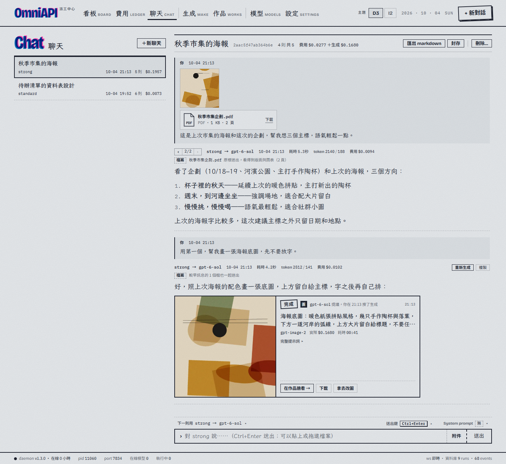
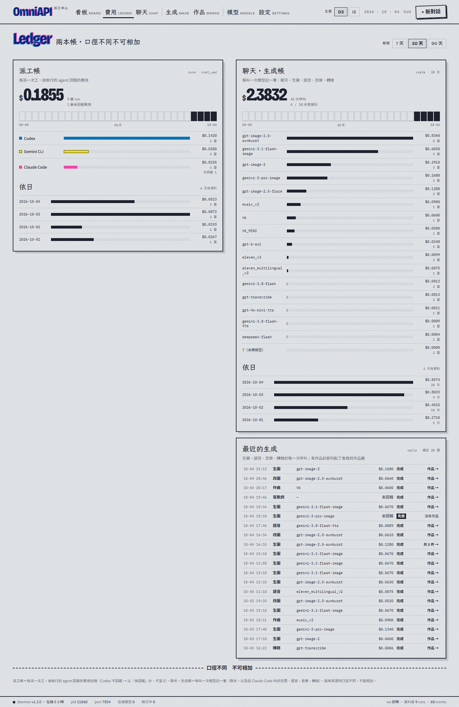
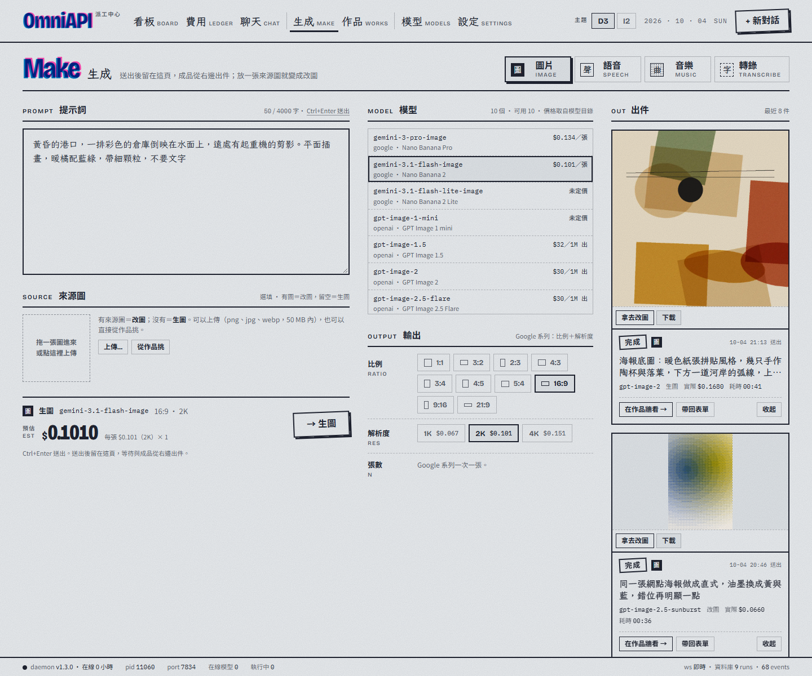
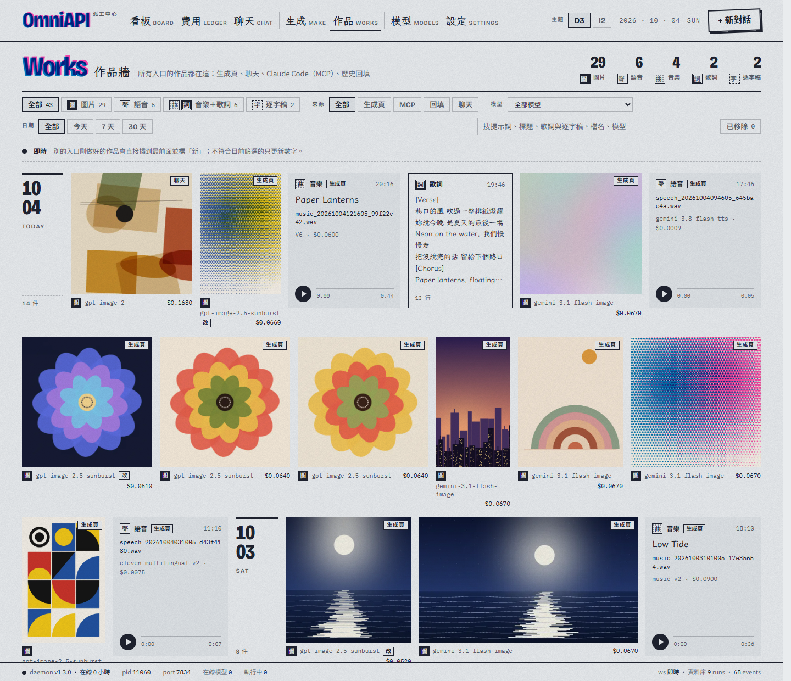
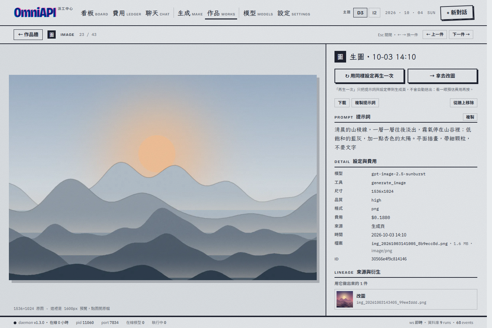
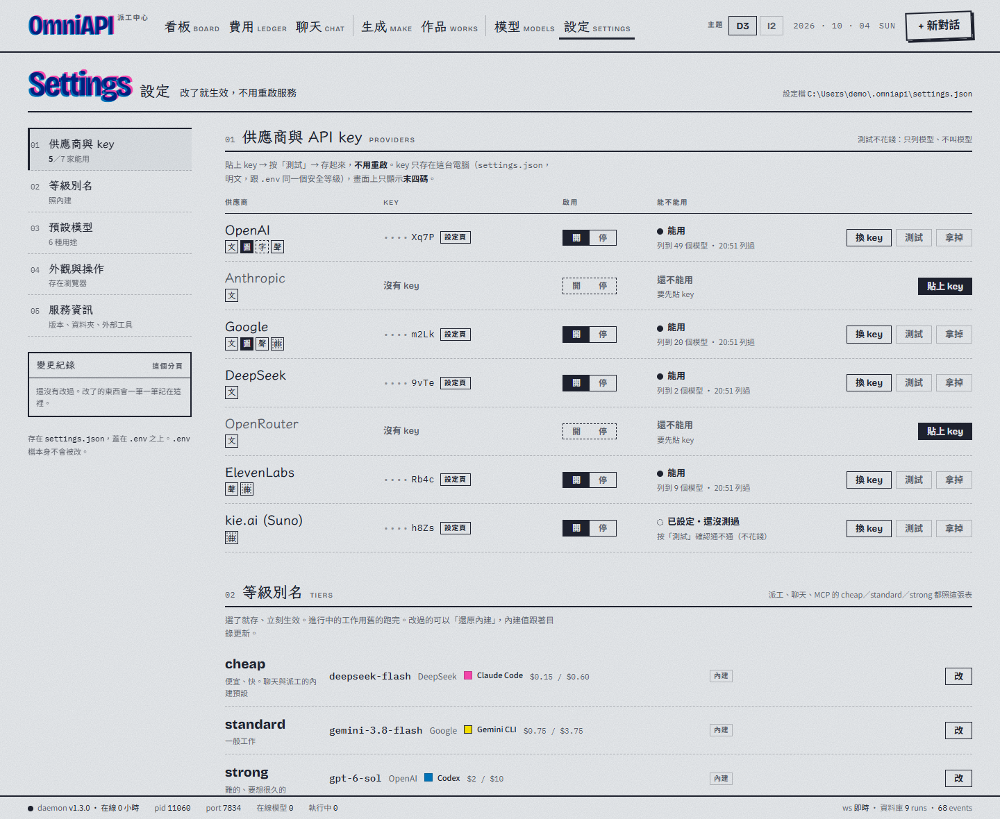
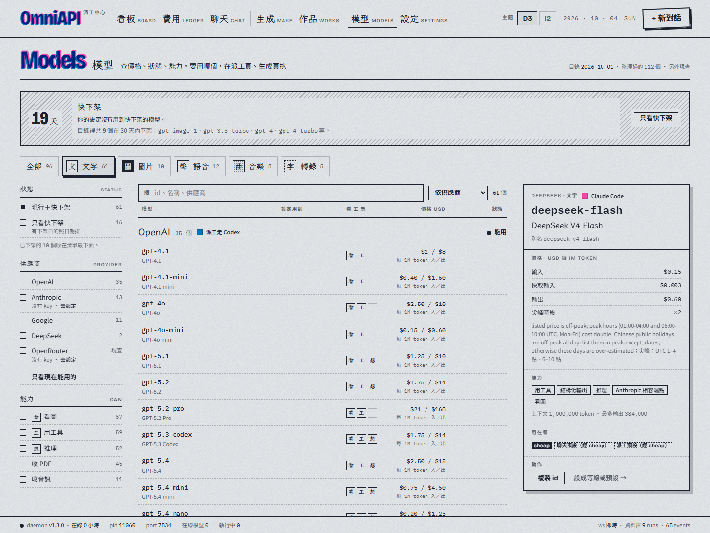
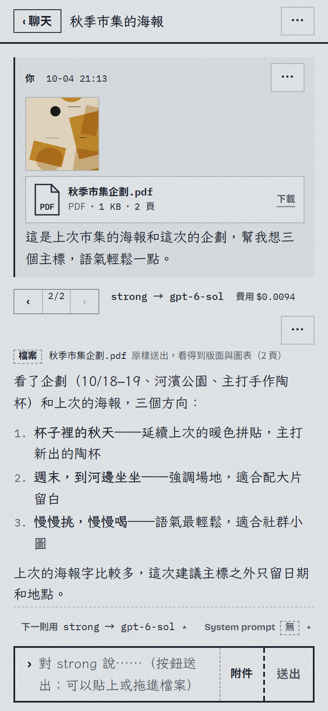

# OmniAPI

> 把外部 AI 模型收進同一個地方用：派工給 agent、跟任何文字模型聊天、生圖與做聲音、看每一筆花了多少；
> Claude Code 透過 MCP 用同一套能力，終端機裡有 `omni` 指令。三個入口，背後是同一個常駐服務、同一顆資料庫。


**OmniAPI** is a local dispatch center for external AI models. One background service (bound to `127.0.0.1`) gives you three doors onto the same store: a web GUI (live board of agent runs, dispatch form, streaming chat with image and file attachments, retries and branches, and images or speech generated inside the conversation, a generation page for images / speech / music / transcripts, a works wall of everything generated, cost ledgers, a model catalog and a settings page where API keys are pasted and tested), an MCP server for Claude Code / Claude Desktop (19 tools: image, transcription, text, chat, speech, music, agent runs), and the `omni` CLI. Agent runs are delegated to the vendor's own headless harness — Claude Code, Codex CLI or Gemini CLI — chosen by model. Install it as a Windows desktop app (a tray icon and a window; Python is bundled) or from a zip with `uv`. The pages fit any width, down to a phone. Tested on Windows 11. MIT licensed.

---

## 這是什麼

OmniAPI 是一個跑在自己電腦上的常駐服務。它做三件事：

| 能力 | 說明 | 從哪裡用 |
|---|---|---|
| **派工** | 把一件事交給 headless agent（Claude Code、Codex CLI、Gemini CLI，依模型自動挑）。它會進你指定的資料夾讀檔、改檔、跑指令，做完回報；可以追問、可以中途中止 | GUI、MCP `run_agent`、`omni run` |
| **聊天** | 跟任何文字模型多輪對話，逐字顯示，每一則都能換模型；可以附圖片與檔案（PDF、Office 文件、試算表、程式碼……），不滿意的回覆重來一次或改了問題另開分岔；想要圖或語音時模型會提議，按下確認才生成 | GUI、MCP `chat`、`omni chat` |
| **生成** | 生圖與改圖、語音合成、音樂生成、語音轉錄：填表、看預估費用、送出，成品從出件口出來 | GUI 生成頁、MCP 工具（在 Claude Code／Claude Desktop 裡使用） |

另外有一面**看板**：正在跑的 agent 在做什麼、跑過哪些、兩本帳各花了多少。不管是從生成頁還是從 Claude Code 叫的，做出來的圖、聲音、歌詞與逐字稿都收進同一面**作品牆**：可以篩選，看提示詞與費用，也查得到每一張是從哪一張改出來的。

**設定頁**是貼 API key 的地方：貼上、按「測試」（只請供應商列出模型清單，不花錢）、存起來，馬上生效、不用重啟；`cheap`／`standard`／`strong` 三個等級各指到哪個模型、聊天與派工等六種用途的預設模型，也都在這裡改。**模型頁**列出每家的模型、價格與能力（看圖、用工具、推理、收 PDF、收音訊），快下架的會提醒。第一次打開、一把 key 都還沒有時，會有一段引導帶你接上第一家。

畫面會隨視窗寬度重排：寬螢幕、半個螢幕、平板到手機寬度都排得開；窄的時候導覽改成底部分頁列。



| 聊天 | 費用 |
|---|---|
|  |  |



| 作品牆 | 作品詳情 |
|---|---|
|  |  |

| 設定 | 模型 |
|---|---|
|  |  |



<sub>截圖裡的專案、對話、作品、金額與 key 都是示範資料：作品是用程式畫出來、合成出來的圖與聲音，key 是假的字串。右邊是手機寬度的聊天頁。</sub>

支援的供應商：OpenAI、Anthropic、Google Gemini、DeepSeek、OpenRouter（長尾模型）、ElevenLabs、kie.ai（Suno）。模型名單在啟動時向各家即時查詢，新模型上線就能用；`cheap`／`standard`／`strong` 三個等級別名會對到當下設定的模型。

<br clear="right">

## 需求

- Windows 11（開發與測試都在這上面；其他平台沒有驗證過）
- 至少一家供應商的 API key
- 要派工的話，另外安裝對應的 harness CLI 並登入：
  [Claude Code](https://docs.claude.com/claude-code)（`claude`）、[Codex CLI](https://github.com/openai/codex)（`codex`）、[Gemini CLI](https://github.com/google-gemini/gemini-cli)（`gemini`）。只裝你會用到的就好。**桌面版也不附這些 CLI**——要用 Claude 派工，要自己裝好並登入 Claude Code
- 用 zip 安裝的話另外要 [uv](https://docs.astral.sh/uv/)（會自己準備 Python 3.10）；從原始碼打包 GUI 才需要 Node.js 20.19 以上或 22.12 以上。桌面版安裝包已經帶著 Python 與網頁介面，這兩個都不用裝

## 安裝

有兩條路，裝出來的是同一個服務、同一套網頁：

- **桌面版安裝包**：下載、執行就好。有系統匣圖示和自己的視窗，開機可以自動啟動。適合想直接用的人
- **zip＋終端機**：用 `uv` 裝、在終端機啟動。適合只用 MCP、或想看原始碼與改程式的人

### 方法一：桌面版安裝包

1. 到 [Releases](https://github.com/TipsyDrifter/omniapi/releases) 下載 `OmniAPI_1.3.0_x64-setup.exe`
2. 執行它。Windows 可能會跳出藍色的「Windows 已保護您的電腦」（SmartScreen）：按「**其他資訊**」，再按「**仍要執行**」。
   會這樣是因為這個安裝包**沒有程式碼簽章**——簽章憑證是付費的，個人開發者不容易申請到，Windows 認不得發行者就會先擋一下。想確認下載的檔案沒被動過，可以對 Release 裡 `SHA256SUMS.txt` 的雜湊：
   ```powershell
   Get-FileHash .\OmniAPI_1.3.0_x64-setup.exe -Algorithm SHA256
   ```
3. 安裝不需要系統管理員權限，預設裝在 `%LOCALAPPDATA%\OmniAPI`
4. 打開 OmniAPI（安裝程式最後一頁可以直接勾選執行，或從開始功能表打開）。右下角系統匣會出現 OmniAPI 的圖示，視窗裡先是「正在啟動」頁：**第一次開要等半分鐘左右**（剛裝好的檔案第一次被讀比較慢），之後幾秒就好
5. 服務起來後，第一次打開會進「首次啟動引導」：選一家供應商、貼上 key、測試（不花錢）、存起來，就能開始聊天或生成

關掉視窗不會停掉服務，它在系統匣裡繼續跑（Claude Code 的 MCP 照常能用）；要整個停掉，在系統匣圖示上按右鍵選「結束」。更新、解除安裝、資料放在哪，見 [USER_GUIDE.md](USER_GUIDE.md) 的〈桌面版〉。

### 方法二：zip＋終端機

到 Releases 下載 `omniapi-v1.3.0.zip`，解壓縮後：

```bash
cd omniapi-v1.3.0/mcp
uv sync
uv run omni serve
```

### 方法三：從原始碼

```bash
git clone https://github.com/TipsyDrifter/omniapi.git
cd omniapi/mcp
uv sync
cd ../gui
npm ci
npm run build
```

桌面版的殼與安裝包怎麼打，見 [desktop/README.md](desktop/README.md)。

## 設定金鑰

最簡單的是在網頁的**設定頁**（導覽的「設定」）貼上：按「測試」確認通不通（只請供應商列出模型清單，不花錢；不通也可以照樣存），存起來就生效，不用重啟。key 存在這台電腦的 `%USERPROFILE%\.omniapi\settings.json`，畫面上只會顯示末四碼。

也可以照舊用 `.env`（zip 與原始碼安裝）：在 `mcp/` 底下把 `.env.example` 複製成 `.env`，填入你有的 key，並把對應的 `ENABLED` 設成 `true`：

```
PROVIDERS__OPENAI__API_KEY=sk-...
PROVIDERS__OPENAI__ENABLED=true

PROVIDERS__DEEPSEEK__API_KEY=...
PROVIDERS__DEEPSEEK__ENABLED=true
```

沒有的那幾家維持 `ENABLED=false`。範例檔裡 OpenAI 預設是開的，沒有 OpenAI key 的話記得關掉。改了 `.env` 要重啟服務才會讀到。兩邊都有時，設定頁的值優先（`.env` 本身不會被改）。

`.env` 與 `settings.json` 都是明文，只留在你的電腦上，不要提交到任何 repo。

## 啟動

**桌面版**：從開始功能表打開 OmniAPI，或在系統匣的選單勾「開機時啟動」，登入 Windows 時就會在背景起來。

**zip 與原始碼安裝**：

```bash
cd mcp
uv run omni serve
```

服務會在背景啟動，綁在 `http://127.0.0.1:7788`。**安裝後第一次啟動大約要一分鐘**，之後幾秒就好；看到 `started: pid …` 就是起來了。常用指令：

| 指令 | 作用 |
|---|---|
| `uv run omni serve` | 啟動（已經在跑就不會重複啟動） |
| `uv run omni status` | 看有沒有在跑、載入了哪些供應商 |
| `uv run omni stop` | 停止 |
| `uv run omni autostart install` | 登入 Windows 時自動啟動 |

兩種裝法用同一個資料夾放資料：資料庫、設定與紀錄檔都在 `%USERPROFILE%\.omniapi`（紀錄檔在 `logs\`）。

沒有填任何 key 也啟動得起來，但聊天、生成，以及派工給 Codex、Gemini CLI 都還不能用（派工給已登入的 Claude Code 可以）。頁面上出現「缺 key」的提示條與章、或 `omni status` 的 `providers` 顯示 `(none …)`，就是這個情況：到設定頁貼一把 key。

## 三個入口

### 網頁（桌面版的視窗也是同一份）

桌面版按系統匣圖示就會打開視窗；zip 安裝的話用瀏覽器打開 <http://127.0.0.1:7788/>。兩邊看到的是同一個服務、同一份資料，可以同時開著。

- **看板**：執行中的 agent 以票券顯示，右邊是它的即時活動流；下面是歷史與兩本帳
- **＋新對話**：選「派工」或「聊天」。派工要選模型和工作目錄；聊天只要選模型
- **聊天**：對話清單與對話內容，輸入列上方可以換下一則要用的模型、改 system prompt，可以匯出成 markdown。訊息可以附圖片與檔案；每則回覆能重新生成、每則問題能改寫，新舊版本用 ‹ 1/2 › 切換；模型提議的圖或語音按「生成」才會做，成品直接出現在對話裡、也收進作品牆。對話可以刪除
- **生成**：生圖（放一張來源圖就變成改圖）、語音、音樂、轉錄。送出前顯示預估費用；送出後可以離開，做好的成品留在出件口
- **作品**：所有做出來的作品，可依類型、來源、模型、日期篩選；點開看大圖或試聽、提示詞、費用，以及它的來源與衍生
- **費用**：兩本帳的明細
- **模型**：每家的模型、價格、能力與狀態；可以篩選、搜尋，快下架的會提醒
- **設定**：API key、等級別名、預設模型、外觀與送出鍵、服務資訊（版本、資料夾、這台電腦上的外部工具、把 Claude Code 接上）

視窗窄到手機寬度時，導覽改成底部的分頁列（模型與設定收在「更多」裡）。操作細節見 [USER_GUIDE.md](USER_GUIDE.md)。

### Claude Code（MCP）

最簡單的是在設定頁最下面的〈服務資訊〉按「把 Claude Code 接上」：它會在 Claude Code 的設定檔加一項指向 `http://127.0.0.1:7788/mcp`，其他內容不動，重開 Claude Code 後生效。

用終端機的話：

```bash
cd mcp
uv run omni mcp-config --apply
```

不加 `--apply` 只會印出設定內容。桌面版的安裝資料夾裡也有 `omni.cmd`，同樣的指令用 `"%LOCALAPPDATA%\OmniAPI\omni.cmd" mcp-config --apply`。

工具清單與參數見 [mcp/README.md](mcp/README.md)；`skill/omniapi/` 是給 Claude 讀的使用說明（skill），可以放進 `~/.claude/skills/`。

Claude Desktop 可以安裝 Release 裡的 `omniapi-mcp.dxt`。它是獨立的 stdio 版 MCP server，不需要常駐服務，但也就沒有看板。

### 終端機

```bash
uv run omni run "把 README 的安裝步驟檢查一遍" --model cheap --cwd C:\path\to\project
uv run omni runs
uv run omni chat "這段程式在做什麼？" --model standard
uv run omni chat
```

`omni run` 會即時印出 agent 的動作；`omni chat` 不帶訊息會進入互動模式。每個指令都有 `--help`。桌面版把 `uv run omni` 換成安裝資料夾裡的 `omni.cmd`。

在 Windows 上把 `omni chat` 的輸出導到檔案或管線時，中文可能變成亂碼；先設定環境變數 `PYTHONIOENCODING=utf-8` 就好。

## 花費與安全

- **這會花錢**。派工和聊天都是用你自己的 API key 呼叫供應商。看板的兩本帳會記下每一筆：派工帳是 agent 回報的費用，聊天・生成帳是每呼叫一次模型記一筆
- **Claude 模型預設走 Claude Code 的訂閱登入**，不扣 API 餘額；要用 API 計費得在派工時明確選擇
- **服務沒有登入機制**，所以只綁 `127.0.0.1`。不要把 7788 埠開放到網路上。會改東西的請求（例如存 key）只收來自這台電腦本身的頁面
- **派工的 agent 會真的改你的檔案、跑指令**。預設是「自動接受改檔」；`yolo` 會略過所有權限確認，除非你清楚後果否則不要開。工作目錄請指定到你願意讓它動的資料夾
- **key 是明文存在你的使用者資料夾裡**（`settings.json` 或 `.env`），跟大多數開發工具一樣；網頁與 API 只顯示末四碼
- 如果供應商的 key 曾經出現在紀錄檔或畫面分享裡，到該供應商後台換一把

## 不花錢先試試：離線沙盒

想先看看介面、或在開發時測試，可以用離線沙盒模式（zip 或原始碼安裝）。它不會呼叫任何供應商：

```bash
cd mcp
OMNIAPI_HOME=/path/to/scratch-home OMNIAPI_DEV=1 OMNIAPI_OFFLINE=1 uv run omni serve --port 7799
```

- `OMNIAPI_HOME`：資料放到另一個資料夾，不碰正式的資料庫
- `OMNIAPI_DEV=1`：開啟兩個替身——`echo` 模型（把固定的稿子逐字吐回來）和「重播」harness（把舊的 run 重新播一次）
- `OMNIAPI_OFFLINE=1`：拒絕所有會打到真供應商的呼叫，連啟動時的模型清單都不查

PowerShell 要先用 `$env:OMNIAPI_DEV = "1"` 這種寫法設定環境變數。

沙盒和正式服務可以同時開著。停沙盒時帶上同一個埠：`uv run omni stop --port 7799`。其他指令（`status`、`chat`、`run`）也都用 `--port` 指定要連哪一台。

## 專案結構

```
mcp/      後端：常駐服務（FastAPI）、MCP server、omni CLI、各家供應商與 harness 的轉接
gui/      前端：React + Vite + TypeScript
desktop/  桌面版：Tauri 的殼（系統匣、視窗、管服務的生死）與打包安裝包的腳本
skill/    給 Claude 讀的 skill
scripts/  發布用的腳本
```

開發：

```bash
cd mcp && uv run python -m pytest tests/unit -q
cd gui && npm run dev            # 連正式服務（7788）
cd gui && npm run dev:sandbox    # 連離線沙盒（7799）
```

## 目前的限制

- 只在 Windows 11 上測試過；桌面版只有 Windows（64 位元）的安裝包
- 安裝包沒有程式碼簽章，第一次執行會被 SmartScreen 擋一下（略過方式見〈安裝〉）
- 桌面版不會自己更新：有新版時系統匣選單與設定頁會提示，要自己下載新的安裝包、執行覆蓋安裝
- 畫面能排到手機寬度，但**還不支援從別台裝置（例如手機）連進來**：服務只綁這台電腦
- 還不支援影片

## 授權

MIT，見 [LICENSE](LICENSE)。

MCP server 的生圖部分最初衍生自 [image-gen-mcp](https://github.com/lansespirit/image-gen-mcp)。
